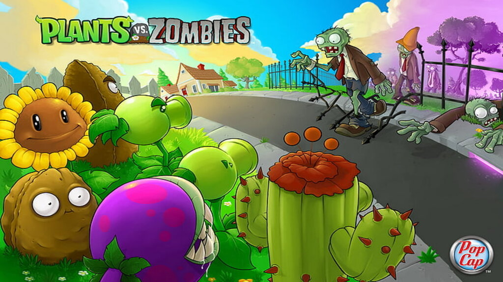

  

  <table dir="rtl" width="100%">
    <tr>
      <td align="right">
        برنامه‌سازی پیشرفته 
        تمرین کامپیوتری شماره ۲
      </td>
      <td align="right">
        مدرس: راضیه قیاسی 
        مهلت تحویل: ۲۰ روز پس از انتشار تمرین
      </td>
  </table>

# **تمرین کامپیوتری شماره ۲ — Plants vs Zombies**

سلام بچه‌ها امیدوارم حالتون خوب باشه 🌱

توی این تمرین قراره یک نسخه ساده‌شده و گرافیکی از بازی **Plants vs Zombies** رو پیاده‌سازی کنید.  

هدف این نیست که بازی اصلی رو کامل و دقیق بازسازی کنید؛ بلکه باید یک نسخه کوچک‌تر، قابل اجرا و قابل توسعه بسازید که ایده اصلی بازی رو داشته باشه.

زامبی‌ها از سمت راست زمین وارد می‌شن و به سمت خونه حرکت می‌کنن. بازیکن باید با کاشتن گیاه‌های مختلف، مدیریت `Sun` و دفاع درست، جلوی رسیدن زامبی‌ها به خونه رو بگیره.

---

## **زبان‌های مجاز**

پروژه می‌تواند با یکی از زبان‌های زیر پیاده‌سازی شود:

* `Python`
* `C++`

برای Python می‌توانید از کتابخانه‌هایی مثل `pygame` استفاده کنید.  
برای C++ می‌توانید از کتابخانه‌هایی مثل `SFML`، `SDL`، `raylib` یا ابزارهای مشابه استفاده کنید.

---

## **قوانین کلی پروژه**

* استفاده از طراحی شیءگرا الزامی است.
* پروژه باید رابط کاربری گرافیکی داشته باشد.
* پیاده‌سازی کاملاً کنسولی قابل قبول نیست.
* استفاده از assetهای داده‌شده برای نمایش بخش‌های اصلی بازی الزامی است.
* منطق اصلی برنامه نباید در تابع `main` یا یک فایل خیلی بزرگ و نامنظم نوشته شود.
* برای بخش‌های اصلی بازی باید کلاس‌های مستقل و مناسب طراحی شود.
* پروژه باید در قالب گروه‌های ۳ نفره انجام شود.
* تحویل پروژه از طریق GitHub Classroom انجام می‌شود.
* نسخه نهایی باید بدون خطای اجرایی اجرا شود.
* در برنچ `master` یا `main` باید نسخه پایدار و قابل اجرای پروژه قرار داشته باشد.
* هر گروه باید آمادگی ارائه پروژه و توضیح طراحی کلاس‌های خود را داشته باشد.

---

## **حداقل خروجی مورد انتظار**

در نسخه نهایی، بازیکن باید بتواند:

* بازی را از طریق رابط کاربری گرافیکی اجرا کند.
* کارت گیاه‌ها را مشاهده و انتخاب کند.
* حداقل سه گیاه اصلی را بکارد:
  * [`PeaShooter`](docs/characters/PeaShooter.md)
  * [`SunFlower`](docs/characters/SunFlower.md)
  * [`WallNut`](docs/characters/WallNut.md)
* مقدار `Sun` فعلی خودش را ببیند.
* `Sun`های تولیدشده را جمع‌آوری کند.
* زامبی‌ها را ببیند که از سمت راست وارد زمین می‌شوند و به سمت چپ حرکت می‌کنند.
* شلیک [`PeaShooter`](docs/characters/PeaShooter.md) و برخورد گلوله با زامبی را ببیند.
* کم شدن جان زامبی‌ها و گیاه‌ها را تجربه کند.
* چند موج زامبی را پشت سر بگذارد.
* در صورت دفاع موفق برنده شود.
* در صورت رسیدن زامبی به خانه، بازی را ببازد.

---

## **زمین بازی**

زمین بازی باید شامل موارد زیر باشد:

* ۵ ردیف
* ۹ ستون
* ورود زامبی‌ها از سمت راست زمین
* قرار گرفتن خانه بازیکن در سمت چپ زمین
* امکان کاشت گیاه در خانه‌های خالی

برای نمایش زمین بازی، باید از asset آماده زیر استفاده شود:

[`Assets/images/items/Frontyard.png`](Assets/images/items/Frontyard.png)

این تصویر باید به‌عنوان پس‌زمینه اصلی زمین بازی قرار بگیرد و گیاه‌ها، زامبی‌ها، گلوله‌ها و `Sun`ها روی همین زمین نمایش داده شوند.

شماره‌گذاری پیشنهادی:

* ردیف‌ها از ۰ تا ۴
* ستون‌ها از ۰ تا ۸
* زامبی‌ها از سمت راست وارد می‌شوند و به سمت چپ حرکت می‌کنند.

هر خانه از زمین در حالت عادی فقط می‌تواند یک گیاه داشته باشد.

گروه‌ها باید روی تصویر [`Frontyard.png`](Assets/images/items/Frontyard.png) یک grid منطقی ۵×۹ در نظر بگیرند تا محل کاشت گیاه‌ها و حرکت زامبی‌ها مشخص باشد. نمایش خطوط grid روی تصویر الزامی نیست، اما منطق داخلی بازی باید دقیقاً بر اساس همین خانه‌بندی انجام شود.

---

## **موارد الزامی پروژه**

موارد زیر برای همه گروه‌ها الزامی است:

* پیاده‌سازی پروژه با `Python` یا `C++`
* استفاده از طراحی شیءگرا
* داشتن رابط کاربری گرافیکی
* استفاده از assetهای داده‌شده برای نمایش بخش‌های اصلی بازی
* پیاده‌سازی زمین ۵×۹
* استفاده از [`Frontyard.png`](Assets/images/items/Frontyard.png) به‌عنوان زمین اصلی بازی
* پیاده‌سازی سیستم `Sun`
* پیاده‌سازی کارت‌های گیاه‌ها
* پیاده‌سازی حداقل سه گیاه اصلی:
  * [`PeaShooter`](docs/characters/PeaShooter.md)
  * [`SunFlower`](docs/characters/SunFlower.md)
  * [`WallNut`](docs/characters/WallNut.md)
* پیاده‌سازی حداقل یک نوع زامبی:
  * [`NormalZombie`](docs/characters/NormalZombie.md)
* پیاده‌سازی حداقل ۳ موج زامبی
* پیاده‌سازی شلیک، برخورد، آسیب و حذف موجودات
* پیاده‌سازی شرط برد و باخت
* آماده بودن گروه برای ارائه و توضیح طراحی پروژه

جزئیات دقیق مربوط به `HP`، سرعت، `cooldown`، هزینه کاشت، آسیب و رفتار هر گیاه و زامبی در مسیر زیر قرار دارد:

[`docs/characters`](docs/characters)

---

## **قابلیت‌های اختیاری**

گروه‌ها می‌توانند برای گرفتن نمره اضافه، قابلیت‌های بیشتری پیاده‌سازی کنند؛ مثل:

* گیاه‌های بیشتر:
  * [`SnowPea`](docs/characters/SnowPea.md)
  * [`Repeater`](docs/characters/Repeater.md)
  * [`CherryBomb`](docs/characters/CherryBomb.md)
  * [`PotatoMine`](docs/characters/PotatoMine.md)
  * [`Chomper`](docs/characters/Chomper.md)
  * [`Jalapeno`](docs/characters/Jalapeno.md)
* زامبی‌های بیشتر:
  * [`ConeheadZombie`](docs/characters/ConeheadZombie.md)
  * [`BucketheadZombie`](docs/characters/BucketheadZombie.md)
  * [`FlagZombie`](docs/characters/FlagZombie.md)
* ابزارهایی مثل:
  * [`Shovel`](docs/characters/Shovel.md)
  * [`LawnMower`](docs/characters/LawnMower.md)
* منوی شروع بازی
* pause menu
* چند level مختلف
* افکت صوتی
* انیمیشن‌های کامل‌تر
* ذخیره و بارگذاری وضعیت بازی

پیاده‌سازی قابلیت‌های اختیاری فقط زمانی امتیاز دارد که بخش‌های الزامی پروژه به شکل قابل قبول کار کنند.

---

## **موجودیت‌های پیشنهادی برای طراحی**

استفاده از همین نام‌ها الزامی نیست، اما پروژه باید طراحی شیءگرای قابل دفاع داشته باشد.

کلاس‌های پیشنهادی:

* `Game`
* `Board` یا `Lawn`
* `Cell`
* `Plant`
* `PeaShooter`
* `SunFlower`
* `WallNut`
* `Zombie`
* `NormalZombie`
* `Projectile`
* `Sun`
* `Card`
* `WaveManager`
* `GameState`

---

## **نمره‌دهی**

نمره الزامی پروژه: ۱۲۰ نمره  
نمره اختیاری پروژه: ۵۰ نمره  
حداکثر نمره قابل کسب: ۱۷۰ نمره

| بخش | نمره |
|---|---:|
| زمین بازی و حلقه اصلی بازی | ۱۰ |
| سیستم `Sun`، کارت‌ها و کاشت گیاه | ۱۴ |
| پیاده‌سازی گیاه‌های الزامی | ۱۶ |
| زامبی‌ها و موج‌ها | ۱۴ |
| مبارزه، برخورد و آسیب | ۱۵ |
| وضعیت بازی، برد و باخت | ۸ |
| رابط کاربری گرافیکی و استفاده از assetها | ۱۵ |
| طراحی شیءگرا و کلاس‌بندی مناسب | ۱۸ |
| کیفیت کد، اعتبارسنجی و مستندات | ۱۰ |
| **جمع کل الزامی** | **۱۲۰** |

---

## **فایل‌های الزامی برای تحویل**

repository گروه باید شامل موارد زیر باشد:

* تمام فایل‌های سورس پروژه
  * برای C++: فایل‌های `.h` و `.cpp`
  * برای Python: فایل‌های `.py`
* فایل `Makefile` یا `CMakeLists.txt` برای C++
* یا توضیح دقیق نحوه اجرا برای Python در [`README.md`](README.md)
* فایل [`README.md`](README.md)
* پوشه assetهای مورد استفاده یا توضیح مسیر دریافت assetها
* توضیح نحوه نصب پیش‌نیازها
* توضیح نحوه اجرا
* چند screenshot از اجرای بازی
* توضیح امکانات پیاده‌سازی‌شده
* توضیح اعضای گروه و مسئولیت هر فرد

---

## **نکته مهم درباره جزئیات بازی**

فایل‌های داخل [`docs/characters`](docs/characters/README.md) مشخص می‌کنند هر کاراکتر دقیقاً چطور رفتار می‌کند.

اگر بین توضیحات کلی [`README.md`](README.md) و فایل‌های جزئیات کاراکترها اختلافی وجود داشت، ملاک ارزیابی فایل‌های داخل [`docs/characters`](docs/characters) است.

