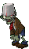

# BucketheadZombie

زامبی اختیاری بسیار مقاوم است.

## وضعیت

اختیاری

## مشخصات

| ویژگی | مقدار |
|---|---:|
| HP | ۱۳۷۰ |
| سرعت حرکت | ۰.۲۵ خانه در ثانیه |
| آسیب به گیاه | ۱۰۰ HP در ثانیه |
| رفتار خاص | بسیار مقاوم |

## رفتار

- مثل NormalZombie حرکت و حمله می‌کند.
- جان بسیار بیشتری دارد.
- بهتر است در موج‌های آخر ظاهر شود.

## assetها

| نوع | مسیر |
|---|---|
| حرکت عادی | `Assets/images/Zombies/BucketheadZombie.gif` |
