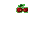

# CherryBomb

گیاه انفجاری اختیاری است.

## وضعیت

اختیاری

## مشخصات

| ویژگی | مقدار |
|---|---:|
| هزینه کاشت | ۱۵۰ Sun |
| HP | ۳۰۰ |
| cooldown کارت | ۵۰ ثانیه |
| نوع عملکرد | انفجار |
| ناحیه اثر | ۳×۳ خانه اطراف محل کاشت |
| آسیب | ۱۸۰۰ |
| زمان انفجار بعد از کاشت | ۱ ثانیه |

## رفتار

- بعد از کاشته شدن، پس از مدت کوتاهی منفجر شود.
- همه زامبی‌های داخل ناحیه ۳×۳ باید آسیب ببینند.
- بعد از انفجار، CherryBomb از زمین حذف شود.
- نمایش افکت انفجار امتیاز اختیاری دارد.

## assetها

| نوع | مسیر |
|---|---|
| کارت | `Assets/images/Cards/CherryBomb.png` |
| گیاه | `Assets/images/Plants/CherryBomb.gif` |
| صدا | `Assets/sounds/cherrybomb.wav` |
