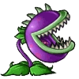

# Chomper

گیاه اختیاری است که یک زامبی نزدیک را می‌خورد.

## وضعیت

اختیاری

## مشخصات

| ویژگی | مقدار |
|---|---:|
| هزینه کاشت | ۱۵۰ Sun |
| HP | ۳۰۰ |
| cooldown کارت | ۷.۵ ثانیه |
| نوع حمله | خوردن یک زامبی نزدیک |
| برد | خانه جلویی |
| زمان جویدن | ۴۰ ثانیه |

## رفتار

- اگر زامبی در خانه جلویی یا خیلی نزدیک Chomper باشد، Chomper آن را می‌خورد.
- بعد از خوردن زامبی، Chomper وارد حالت chewing شود.
- در حالت chewing نباید بتواند زامبی دیگری بخورد.
- استفاده از asset مربوط به `ChomperEatting` امتیاز اختیاری دارد.

## assetها

| نوع | مسیر |
|---|---|
| کارت | `Assets/images/Cards/Chomper.png` |
| گیاه | `Assets/images/Plants/Chomper.gif` |
| حالت خوردن | `Assets/images/Plants/ChomperEatting.gif` |
| صدا | `Assets/sounds/chomp.wav` |
