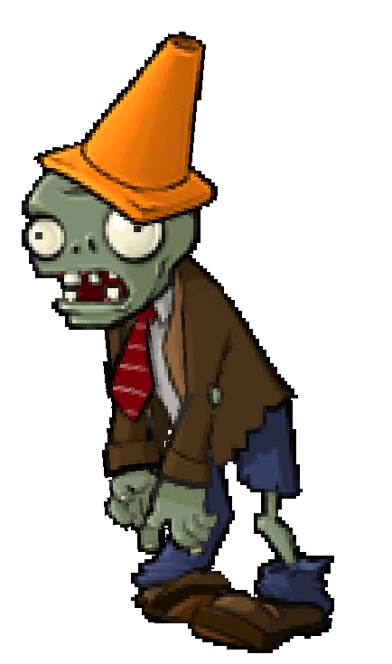

# ConeheadZombie

زامبی اختیاری با HP بیشتر نسبت به NormalZombie است.

## وضعیت

اختیاری

## مشخصات

| ویژگی | مقدار |
|---|---:|
| HP | ۶۴۰ |
| سرعت حرکت | ۰.۲۵ خانه در ثانیه |
| آسیب به گیاه | ۱۰۰ HP در ثانیه |
| رفتار خاص | HP بیشتر نسبت به NormalZombie |

## رفتار

- مثل NormalZombie حرکت و حمله می‌کند.
- فقط جان بیشتری دارد.
- بهتر است در موج‌های میانی یا پایانی ظاهر شود.

## assetها

| نوع | مسیر |
|---|---|
| حرکت عادی | `Assets/images/Zombies/ConeheadZombie.gif` |
| حالت خوردن | `Assets/images/Zombies/ConeheadZombie_Eat.gif` |
