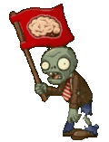

# FlagZombie

زامبی اختیاری برای شروع موج بزرگ است.

## وضعیت

اختیاری

## مشخصات

| ویژگی | مقدار |
|---|---:|
| HP | ۲۰۰ |
| سرعت حرکت | ۰.۳ خانه در ثانیه |
| آسیب به گیاه | ۱۰۰ HP در ثانیه |
| رفتار خاص | شروع موج بزرگ |

## رفتار

- در ابتدای موج‌های بزرگ وارد شود.
- کمی سریع‌تر از NormalZombie حرکت کند.
- می‌تواند فقط نقش نمایشی داشته باشد؛ یعنی با ورود آن موج بزرگ شروع شود.

## assetها

| نوع | مسیر |
|---|---|
| حرکت عادی | `Assets/images/Zombies/FlagZombie.gif` |
| حالت خوردن | `Assets/images/Zombies/FlagZombie_Eat.gif` |
| آیکن/پرچم | `Assets/images/items/Flag.png` |
