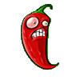

# Jalapeno

گیاه اختیاری است که یک ردیف کامل را پاک می‌کند.

## وضعیت

اختیاری

## مشخصات

| ویژگی | مقدار |
|---|---:|
| هزینه کاشت | ۱۲۵ Sun |
| HP | ۳۰۰ |
| cooldown کارت | ۵۰ ثانیه |
| نوع عملکرد | پاک کردن یک ردیف |
| ناحیه اثر | کل ردیف |
| آسیب | ۱۸۰۰ |
| زمان فعال شدن | ۱ ثانیه |

## رفتار

- بعد از کاشت، کل ردیف خودش را آتش بزند.
- همه زامبی‌های همان ردیف باید آسیب سنگین ببینند.
- بعد از فعال شدن حذف شود.
- استفاده از asset مربوط به `jalapenoFire` امتیاز اختیاری دارد.

## assetها

| نوع | مسیر |
|---|---|
| کارت | `Assets/images/Cards/Jalapeno.png` |
| گیاه | `Assets/images/Plants/Jalapeno.gif` |
| آتش | `Assets/images/items/jalapenoFire.gif` |
| صدا | `Assets/sounds/jalapeno.wav` |
