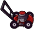

# LawnMower

ابزار دفاعی اختیاری است.

## وضعیت

اختیاری

## مشخصات

| ویژگی | مقدار |
|---|---:|
| تعداد | یک عدد برای هر ردیف |
| محل قرارگیری | سمت چپ هر ردیف |
| دفعات استفاده | فقط یک بار |
| اثر | حذف همه زامبی‌های همان ردیف |

## رفتار

- اگر زامبی به انتهای چپ ردیف برسد و LawnMower آن ردیف هنوز استفاده نشده باشد، LawnMower فعال شود.
- LawnMower باید به سمت راست حرکت کند.
- همه زامبی‌های همان ردیف را حذف کند.
- بعد از خروج از صفحه حذف شود.
- اگر بعد از استفاده LawnMower دوباره زامبی به انتهای همان ردیف برسد، بازیکن ببازد.

## assetها

| نوع | مسیر |
|---|---|
| حالت idle | `Assets/images/items/lawnMower_Idle.png` |
| حالت فعال | `Assets/images/items/lawnMower_Active.gif` |
| صدا | `Assets/sounds/lawnmower.wav` |
