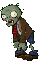

# NormalZombie

زامبی ساده بازی است.

## وضعیت

الزامی

## مشخصات

| ویژگی | مقدار |
|---|---:|
| HP | ۲۰۰ |
| سرعت حرکت | ۰.۲۵ خانه در ثانیه |
| آسیب به گیاه | ۱۰۰ HP در ثانیه |
| رفتار خاص | ندارد |

## رفتار

- از سمت راست وارد زمین می‌شود.
- به سمت چپ حرکت می‌کند.
- اگر به گیاه برسد، باید بایستد و به آن آسیب بزند.
- اگر گیاه حذف شد، باید دوباره حرکت کند.
- اگر به انتهای سمت چپ زمین برسد، بازیکن می‌بازد.

## assetها

| نوع | مسیر |
|---|---|
| حرکت عادی | `Assets/images/Zombies/NormalZombie.gif` |
| حالت خوردن | `Assets/images/Zombies/NormalZombieEat.gif` |
| حالت دویدن | `Assets/images/Zombies/NormalZombieRun.gif` |
