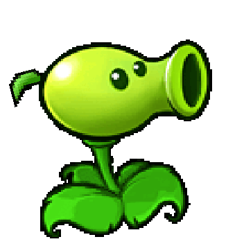

# PeaShooter

گیاه حمله‌ای اصلی بازی است و در ردیف خودش به زامبی‌ها شلیک می‌کند.

## وضعیت

الزامی

## مشخصات

| ویژگی | مقدار |
|---|---:|
| هزینه کاشت | ۱۰۰ Sun |
| HP | ۳۰۰ |
| cooldown کارت | ۷.۵ ثانیه |
| نوع حمله | شلیک گلوله در همان ردیف |
| آسیب هر گلوله | ۲۰ |
| فاصله زمانی بین شلیک‌ها | ۱.۵ ثانیه |
| برد | تا انتهای همان ردیف |

## رفتار

- اگر در همان ردیف PeaShooter حداقل یک زامبی جلوتر از آن وجود داشته باشد، باید شلیک کند.
- گلوله باید از چپ به راست حرکت کند.
- اگر گلوله به زامبی برخورد کند، باید از HP زامبی کم شود.
- اگر هیچ زامبی‌ای در آن ردیف وجود ندارد، PeaShooter نباید بی‌دلیل شلیک کند.

## assetها

| نوع | مسیر |
|---|---|
| کارت | `Assets/images/Cards/PeaShooter.png` |
| گیاه | `Assets/images/Plants/Peashooter.gif` |
| گلوله | `Assets/images/items/Pea.png` |
