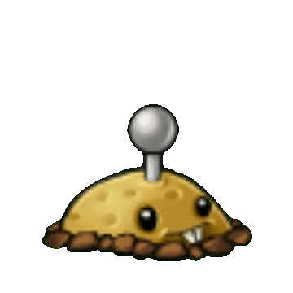

# PotatoMine

گیاه انفجاری اختیاری است که بعد از آماده شدن فعال می‌شود.

## وضعیت

اختیاری

## مشخصات

| ویژگی | مقدار |
|---|---:|
| هزینه کاشت | ۲۵ Sun |
| HP | ۳۰۰ |
| cooldown کارت | ۳۰ ثانیه |
| زمان آماده‌سازی | ۱۴ ثانیه |
| آسیب | ۱۸۰۰ |
| ناحیه اثر | همان خانه یا فاصله خیلی نزدیک |

## رفتار

- بعد از کاشت، ابتدا غیرفعال باشد.
- بعد از زمان آماده‌سازی فعال شود.
- اگر زامبی روی آن برسد، منفجر شود و به زامبی آسیب سنگین بزند.
- بعد از انفجار حذف شود.
- اگر قبل از آماده شدن خورده شود، نباید منفجر شود.

## assetها

| نوع | مسیر |
|---|---|
| کارت | `Assets/images/Cards/PotatoMine.png` |
| گیاه | `Assets/images/Plants/PotatoMine.gif` |
