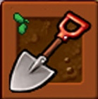

# Shovel

## رفتار

- کاربر بتواند Shovel را انتخاب کند.
- سپس روی یک گیاه کلیک کند و آن را حذف کند.
- حذف گیاه نباید باعث crash یا خراب شدن وضعیت بازی شود.
- بعد از حذف گیاه، خانه باید دوباره قابل کاشت باشد.

## assetها

| نوع | مسیر |
|---|---|
| ابزار | `Assets/images/items/Shovel.png` |
