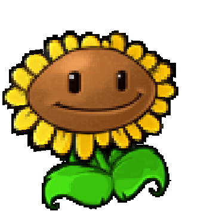

# SunFlower

گیاه تولیدکننده منبع بازی است.

## وضعیت

الزامی

## مشخصات

| ویژگی | مقدار |
|---|---:|
| هزینه کاشت | ۵۰ Sun |
| HP | ۳۰۰ |
| cooldown کارت | ۷.۵ ثانیه |
| نوع عملکرد | تولید Sun |
| مقدار هر Sun تولیدی | ۲۵ |
| فاصله تولید Sun | هر ۲۴ ثانیه |
| آسیب | ندارد |

## رفتار

- هر SunFlower باید هر ۲۴ ثانیه یک Sun تولید کند.
- کاربر باید بتواند Sun تولیدشده را جمع‌آوری کند.
- بعد از جمع‌آوری Sun، مقدار منبع بازیکن باید افزایش پیدا کند.
- SunFlower نباید به زامبی‌ها حمله کند.
- برای ساده‌تر شدن پروژه، می‌توانید اولین Sun هر SunFlower را زودتر، مثلاً بعد از ۷ ثانیه، تولید کنید.

## assetها

| نوع | مسیر |
|---|---|
| کارت | `Assets/images/Cards/SunFlower.png` |
| گیاه | `Assets/images/Plants/SunFlower.gif` |
| Sun | `Assets/images/items/Sun.png` |
